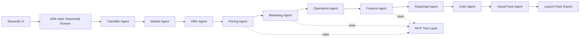

# LaunchForge

**Adaptive Multi-Agent Small Business Launch Studio**

LaunchForge turns a rough small-business idea into a practical launch pack: classification, personas, offer ladder, pricing, funnel, roadmap, operations checklist, cashflow forecast, risks, and exportable Markdown/JSON.

This was built for Kaggle's **5-Day AI Agents: Intensive Vibe Coding Course With Google** capstone. It demonstrates an ADK-style multi-agent system, MCP-style tool layer, reusable agent skills, security/privacy choices, and deployability.

## 60-Second Judge Summary

- **What it does:** converts a raw small-business idea into a visual launch pack.
- **Why it matters:** avoids generic advice by adapting outputs for local service, physical retail, and ecommerce launches.
- **Agentic core:** 10 specialist agents run through an ADK-style sequential workflow.
- **Tooling:** MCP-style tools power classification, pricing, cashflow, funnel, tasks, and exports.
- **Skills:** reusable skills wrap cashflow, funnel, export, and final pack assembly.
- **Trust:** no required API key, input sanitization, privacy mode, no automatic disk persistence.
- **Demo path:** use the three sidebar buttons: Tutoring, Corner Shop, Shopify.
- **Run command:** `streamlit run app.py`

## Problem

Small-business founders often have an idea but not a clear execution path. Generic business-plan generators miss the operational differences between a local tutoring service, a corner shop, and a Shopify store. LaunchForge adapts the pack to the business model so the next steps are specific enough to act on.

## Solution Overview

The Streamlit app collects a founder's idea, budget, launch stage, location, resources, and optional target customer. A deterministic multi-agent workflow then creates a tailored launch pack. The app runs without API keys; `GOOGLE_API_KEY` is optional for future Gemini integration.

Supported classifications:

- `local_service`
- `physical_retail`
- `ecommerce`
- `digital_product`
- `food_drink`
- `b2b_service`
- `event_community`
- `unknown`

The MVP has strongest tailoring for local service, physical retail, and ecommerce.

## Why Agents?

Launch planning is naturally multi-disciplinary. One model prompt can produce a wall of advice, but a multi-agent architecture creates cleaner responsibility boundaries:

- Classifier Agent: identifies the business model.
- Market Agent: builds personas and customer segments.
- Offer Agent: creates a staged offer ladder.
- Pricing Agent: creates pricing assumptions.
- Marketing Agent: builds channels, funnel, hooks, and outreach copy.
- Operations Agent: creates delivery/supplier/daily operations checklists.
- Finance Agent: forecasts 3-month cashflow and break-even.
- Roadmap Agent: builds the 30-day plan.
- Critic Agent: checks assumptions and scores readiness.
- Visual Pack Agent: prepares diagrams and dashboard data.

## Architecture



`launchforge/agent_runtime.py` provides a clean ADK-style compatibility layer. If the real Google ADK package is available, this project can be extended to wrap the same agent classes; otherwise the included runner keeps the workflow deterministic and testable.

## MCP Tools

`launchforge/mcp_server/tools.py` contains tool functions that the agents and tests call directly:

- `classify_business_model`
- `build_cashflow_forecast`
- `generate_sales_funnel`
- `create_launch_tasks`
- `create_pricing_table`
- `export_launch_pack`

`launchforge/mcp_server/server.py` exposes them through FastMCP when available. If the MCP package is not installed, a documented local registry fallback is used.

## Agent Skills

Reusable skills live in `launchforge/skills/`:

- `launch_pack_skill.py`: validates and assembles the final Pydantic launch pack.
- `cashflow_skill.py`: wraps forecast generation.
- `funnel_skill.py`: wraps funnel generation.
- `export_skill.py`: creates Markdown or JSON exports.

These skills are called by the workflow and specialist agents.

## Security Features

- No API keys are required or hard-coded.
- `.env.example` contains placeholders only.
- Input text is sanitized and capped to avoid accidental huge prompts.
- Streamlit includes a privacy toggle: "Do not store my business idea".
- User inputs are not written to disk unless the user explicitly downloads an export.
- `.gitignore` excludes `.env`, caches, secrets, and generated exports.
- Financial forecasts include a planning disclaimer.

See `docs/security.md` for details.

## Setup

```bash
cd launchforge
python -m venv .venv
source .venv/bin/activate
pip install -r requirements.txt
streamlit run app.py
```

On Windows PowerShell:

```powershell
cd launchforge
python -m venv .venv
.\.venv\Scripts\Activate.ps1
pip install -r requirements.txt
streamlit run app.py
```

## Streamlit Community Cloud

1. Push this repository to GitHub.
2. Create a new Streamlit app.
3. Set the app entry point to `app.py`.
4. Add no secrets for deterministic mode, or add `GOOGLE_API_KEY` later for an LLM extension.

## Docker

```bash
cd launchforge
docker build -t launchforge .
docker run -p 8501:8501 launchforge
```

## Demo Scenarios

The sidebar includes three demo buttons:

- Tutoring business: local service launch with referral loops and diagnostic sessions.
- Corner shop: physical retail launch with footfall, stock, suppliers, and daily operations.
- Shopify store: ecommerce launch with hero product validation, bundles, content, and fulfilment.

The same inputs are stored in `assets/demo_inputs.json`.

## Screenshots

Add final screenshots before submission:

- `assets/screenshot_overview.png`
- `assets/screenshot_customers_offer.png`
- `assets/screenshot_finance.png`
- `assets/screenshot_export.png`

## Limitations

- Forecasts are illustrative and not financial advice.
- Classification is deterministic keyword-based in the no-key MVP.
- Real market research, legal checks, supplier verification, and accounting review still require human work.

## Future Work

- Gemini-powered reasoning with deterministic fallback comparison.
- Browser-based market research tools.
- Real CRM/task-board export.
- More business-type templates.
- User-owned encrypted export history.

## Kaggle Submission Notes

LaunchForge demonstrates:

- Multi-agent system using an ADK-style runtime.
- MCP server/tooling with fallback.
- Agent skills as reusable capabilities.
- Security and privacy choices.
- Deployability through Streamlit, Docker, and documented setup.

## Antigravity Notes

For the video/writeup, Antigravity can be shown as the development environment used to inspect, refactor, and test the agent workflow. A good clip: open `workflow.py`, jump into an agent, inspect `mcp_server/tools.py`, run `pytest`, then launch `streamlit run app.py` and generate the three demo packs.
