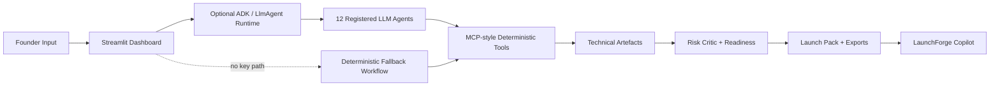

# LaunchForge

**Adaptive Multi-Agent Small Business Launch Studio**

LaunchForge turns a rough small-business idea into a practical launch pack: classification, personas, offer ladder, pricing, funnel, roadmap, operations checklist, cashflow forecast, risks, and exportable Markdown/JSON.

This was built for Kaggle's **5-Day AI Agents: Intensive Vibe Coding Course With Google** capstone. It demonstrates ADK/LlmAgent-style agent definitions, an MCP-style deterministic tool layer, reusable agent skills, security/privacy choices, and deployability.

## 60-Second Judge Summary

- **What it does:** converts a raw small-business idea into a premium dashboard-style launch pack.
- **Why it matters:** avoids generic advice by adapting outputs for local service, physical retail, and ecommerce launches.
- **Agentic core:** 12 registered LLM agent definitions remain visible in the Agent Control Room; Copilot can call Gemini through `google-genai` when `GOOGLE_API_KEY` is configured.
- **Tooling:** MCP-style deterministic tools power classification, segment scoring, offer-fit, pricing scenarios, funnel modelling, capacity, cashflow simulation, roadmap priorities, critic checks, Copilot helpers, and exports.
- **Skills:** reusable Python skills plus `.agents/skills` policies wrap launch-pack validation, pricing, funnel, finance review, red-team critique, outreach, export, and final pack assembly.
- **Trust:** no required API key, input sanitization, privacy mode, no automatic disk persistence.
- **Dashboard proof:** visible agent trace, classifier evidence chips, readiness strengths/gaps, currency-aware pricing, and forecast assumptions.
- **Agent Control Room:** shows ADK runtime status, LLM agent definitions, deterministic tool mapping, execution trace, and Copilot.
- **Technical artefacts:** segment scoring, offer-fit scoring, pricing scenarios, funnel model, capacity model, scenario forecasts, roadmap priorities, and red-team critique.
- **Demo path:** use the three sidebar buttons: Tutoring, Corner Shop, Shopify.
- **Run command:** `streamlit run app.py`

## Problem

Small-business founders often have an idea but not a clear execution path. Generic business-plan generators miss the operational differences between a local tutoring service, a corner shop, and a Shopify store. LaunchForge adapts the pack to the business model so the next steps are specific enough to act on.

## Solution Overview

The Streamlit app collects a founder's idea, budget, launch stage, location, resources, and optional target customer. LaunchForge then routes the context through registered ADK/LlmAgent-style specialists and reliable MCP-style tools. In the public no-key mode, deterministic fallback orchestration produces the same structured artefacts so the app stays demoable and testable. The dashboard shows KPI cards, agent trace cards, classifier evidence chips, Business Model Canvas tiles, technical modelling outputs, pricing cards, finance assumptions, roadmap cards, Copilot, and exports.

Supported classifications:

- `local_service`
- `physical_retail`
- `ecommerce`
- `digital_product`
- `food_drink`
- `b2b_service`
- `event_community`
- `unknown`

The MVP has strongest tailoring for local service, physical retail, and ecommerce.

## Why Agents?

Launch planning is naturally multi-disciplinary. One model prompt can produce a wall of advice, but a multi-agent architecture creates cleaner responsibility boundaries.

LaunchForge is explicit about agent/tool separation:

- **ADK/LlmAgent definitions** live in `launchforge/agent_registry.py` and can be constructed through `launchforge/adk_runtime.py` when Google ADK and `GOOGLE_API_KEY` are configured.
- **Deterministic tools** live in `launchforge/mcp_server/tools.py` and compute reliable structured artefacts.
- **Fallback mode** is the public-demo default: no API key is required, tests never call external APIs, and the dashboard clearly shows runtime mode.
- **Copilot** answers questions from the current launch pack with Gemini when configured, plus deterministic fallback routing, creative helpers, and prompt-injection/PII guardrails.

The registered LLM agent team includes:

- Classifier Agent: identifies the business model.
- Market Agent: builds personas and customer segments.
- Offer Agent: creates a staged offer ladder.
- Pricing Agent: creates pricing assumptions.
- Marketing Agent: builds channels, funnel, hooks, and outreach copy.
- Operations Agent: creates delivery/supplier/daily operations checklists.
- Finance Simulation Agent: forecasts scenarios, break-even probability, and visible planning assumptions.
- Roadmap Agent: builds the 30-day plan.
- Critic Agent: checks assumptions, scores readiness realistically by stage, and explains strengths/gaps.
- Visual Packaging Agent: prepares dashboard and export artefacts.
- LaunchForge Copilot Agent: answers grounded user questions about the current pack.

## Architecture



`launchforge/adk_runtime.py` provides runtime detection for Google ADK and `google-genai`. It checks `GOOGLE_API_KEY`, reports provider, model, ADK availability, GenAI availability, and mode, and never exposes the key. `launchforge/copilot_agent.py` uses `google-genai` for the actual Gemini Copilot call when available, while `launchforge/agent_runtime.py` keeps the no-key fallback workflow deterministic and testable.

## MCP Tools

`launchforge/mcp_server/tools.py` contains tool functions that the agents and tests call directly:

- `classify_business_model`
- `build_cashflow_forecast`
- `generate_sales_funnel`
- `create_launch_tasks`
- `create_pricing_table`
- `export_launch_pack`
- `score_customer_segments`
- `score_offer_fit`
- `build_pricing_scenarios`
- `build_funnel_model`
- `build_capacity_model`
- `simulate_cashflow_scenarios`
- `prioritize_launch_tasks`
- `run_red_team_checks`
- `explain_readiness_score`
- `improve_marketing_message`
- `suggest_next_action`
- `package_dashboard_outputs`

`launchforge/mcp_server/server.py` exposes them through FastMCP when available. If the MCP package is not installed, a documented local registry fallback is used.

## Agent Skills

Reusable skills live in `launchforge/skills/`:

- `launch_pack_skill.py`: validates and assembles the final Pydantic launch pack.
- `cashflow_skill.py`: wraps forecast generation.
- `funnel_skill.py`: wraps funnel generation.
- `export_skill.py`: creates Markdown or JSON exports.

These skills are called by the workflow and specialist agents.

The `.agents/skills/` directory documents capstone-facing agent skills for launch-pack validation, pricing scenario analysis, growth funnel design, finance simulation review, red-team critique, and outreach drafting.

## Security Features

- No API keys are required or hard-coded.
- `.env.example` contains placeholders only.
- Input text is sanitized and capped to avoid accidental huge prompts.
- Copilot detects prompt-injection phrases such as requests to ignore instructions or reveal hidden prompts.
- Copilot redacts email, phone, and API-key-like strings before answering.
- Streamlit includes a privacy toggle: "Do not store my business idea".
- User inputs are not written to disk unless the user explicitly downloads an export.
- `.gitignore` excludes `.env`, caches, secrets, and generated exports.
- Financial forecasts include a planning disclaimer.

See `docs/security.md` for details.

## Setup

```bash
cd launchforge
python -m venv .venv
source .venv/bin/activate
pip install -r requirements.txt
streamlit run app.py
```

On Windows PowerShell:

```powershell
cd launchforge
python -m venv .venv
.\.venv\Scripts\Activate.ps1
pip install -r requirements.txt
streamlit run app.py
```

## Streamlit Community Cloud

1. Push this repository to GitHub.
2. Create a new Streamlit app.
3. Set the app entry point to `app.py`.
4. Add no secrets for deterministic mode, or add `GOOGLE_API_KEY` later for Gemini-assisted Copilot mode.

## Docker

```bash
cd launchforge
docker build -t launchforge .
docker run -p 8501:8501 launchforge
```

## Demo Scenarios

The sidebar includes three demo buttons:

- Tutoring business: local service launch with referral loops and diagnostic sessions.
- Corner shop: physical retail launch with footfall, stock, suppliers, and daily operations.
- Shopify store: ecommerce launch with hero product validation, bundles, content, and fulfilment.

These demos intentionally produce different dashboards: tutoring uses GBP pricing, diagnostic sessions, parent/student updates, booking workflow, and testimonials; corner shop emphasizes footfall, stock, suppliers, opening-week bundles, and daily operations; Shopify emphasizes product validation, product-page conversion, content tests, fulfilment, AOV, and gross margin.

The same inputs are stored in `assets/demo_inputs.json`.

## Screenshots

Add final screenshots before submission:

- `assets/screenshot_overview.png`
- `assets/screenshot_customers_offer.png`
- `assets/screenshot_finance.png`
- `assets/screenshot_export.png`

## Limitations

- Forecasts are illustrative and not financial advice.
- Classification is deterministic keyword-based in the no-key MVP.
- Real market research, legal checks, supplier verification, and accounting review still require human work.

## Future Work

- Gemini-powered reasoning with deterministic fallback comparison.
- Browser-based market research tools.
- Real CRM/task-board export.
- More business-type templates.
- User-owned encrypted export history.

## Kaggle Submission Notes

LaunchForge demonstrates:

- ADK/LlmAgent-style agent definitions with an optional real ADK construction path.
- Deterministic fallback orchestration that keeps the public demo reliable without secrets.
- MCP server/tooling with local fallback.
- Agent skills as reusable capabilities and policy files.
- Agent Control Room with runtime status, tool mapping, execution trace, and Copilot.
- Security and privacy choices.
- Deployability through Streamlit, Docker, and documented setup.

## Antigravity Notes

For the video/writeup, Antigravity can be shown as the development environment used to inspect, refactor, and test the agent workflow. A good clip: open `workflow.py`, jump into an agent, inspect `mcp_server/tools.py`, run `pytest`, then launch `streamlit run app.py` and generate the three demo packs.
