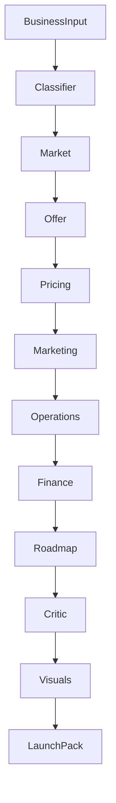

# Architecture

LaunchForge is a Streamlit application backed by a deterministic ADK-style multi-agent workflow.

## Runtime

`launchforge/agent_runtime.py` defines:

- `RunnableAgent`: protocol for `name`, `role`, and `run(context)`.
- `AgentSession`: shared state and event log.
- `SequentialAgentRunner`: ordered orchestration.

This mirrors the shape of an ADK app while keeping the capstone runnable without installing Google ADK.

## Data Flow

## Tooling

MCP tools live in `launchforge/mcp_server/tools.py`. They provide classification, pricing, cashflow, funnel, launch tasks, and export functions. Agents call these tools directly or through skills.

## Schemas

`schemas.py` contains Pydantic models for the full workflow. The final output is validated as a `LaunchPack`.
