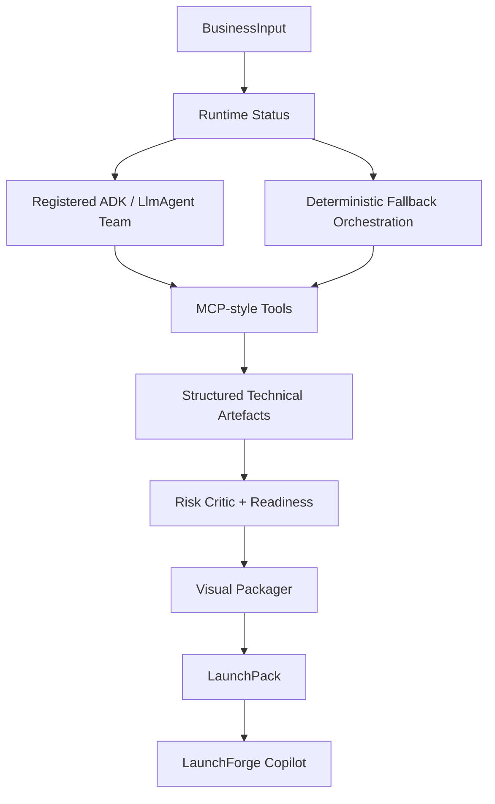

# Architecture

LaunchForge is a Streamlit application backed by a three-layer agent architecture:

1. Deterministic MCP-style tools for reliable calculations.
2. Optional ADK/LlmAgent definitions for AI-assisted reasoning and synthesis.
3. Product dashboard with launch pack, Agent Control Room, Copilot, exports, and technical artefacts.

## Runtime

`launchforge/adk_runtime.py` defines runtime status for the optional ADK bridge and direct Gemini path. It attempts to import `LlmAgent`, `Runner`, `InMemorySessionService`, and `google-genai`, but safely falls back when Gemini, ADK, or `GOOGLE_API_KEY` is unavailable.

`launchforge/agent_registry.py` defines the registered LLM agent team. `launchforge/agent_runtime.py` still supports the deterministic fallback workflow:

- `RunnableAgent`: protocol for `name`, `role`, and `run(context)`.
- `AgentSession`: shared state and event log.
- `SequentialAgentRunner`: ordered orchestration.

This mirrors the shape of an ADK app while keeping the capstone runnable without installing Google ADK.

## Data Flow

## Tooling

MCP-style tools live in `launchforge/mcp_server/tools.py`. They provide classification, segment scoring, offer-fit scoring, pricing scenarios, funnel model, capacity model, scenario forecasts, roadmap priorities, red-team checks, Copilot helpers, dashboard packaging, and export functions. Agents call these tools directly or through skills.

## Agent Control Room

The app includes an Agent Control Room tab with runtime status, provider, selected model, ADK availability, GenAI availability, LLM agent team, deterministic tool mapping, execution trace, and Copilot. Trace entries distinguish `llm_agent`, `tool`, and fallback events.

## Schemas

`schemas.py` contains Pydantic models for the full workflow. The final output is validated as a `LaunchPack`, including runtime status, agent registry, tool registry, execution trace, segment scores, offer-fit scores, pricing scenarios, funnel model, capacity model, scenario forecasts, roadmap priorities, and red-team critique.
